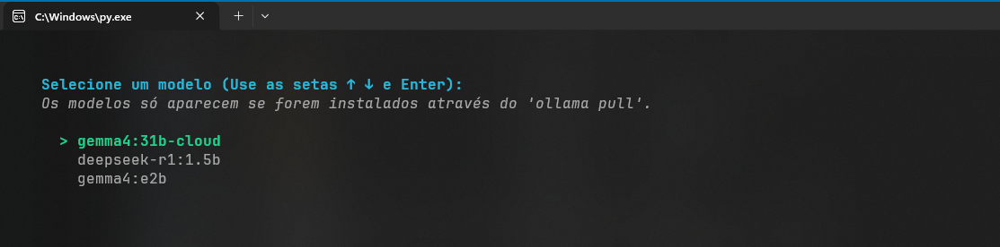
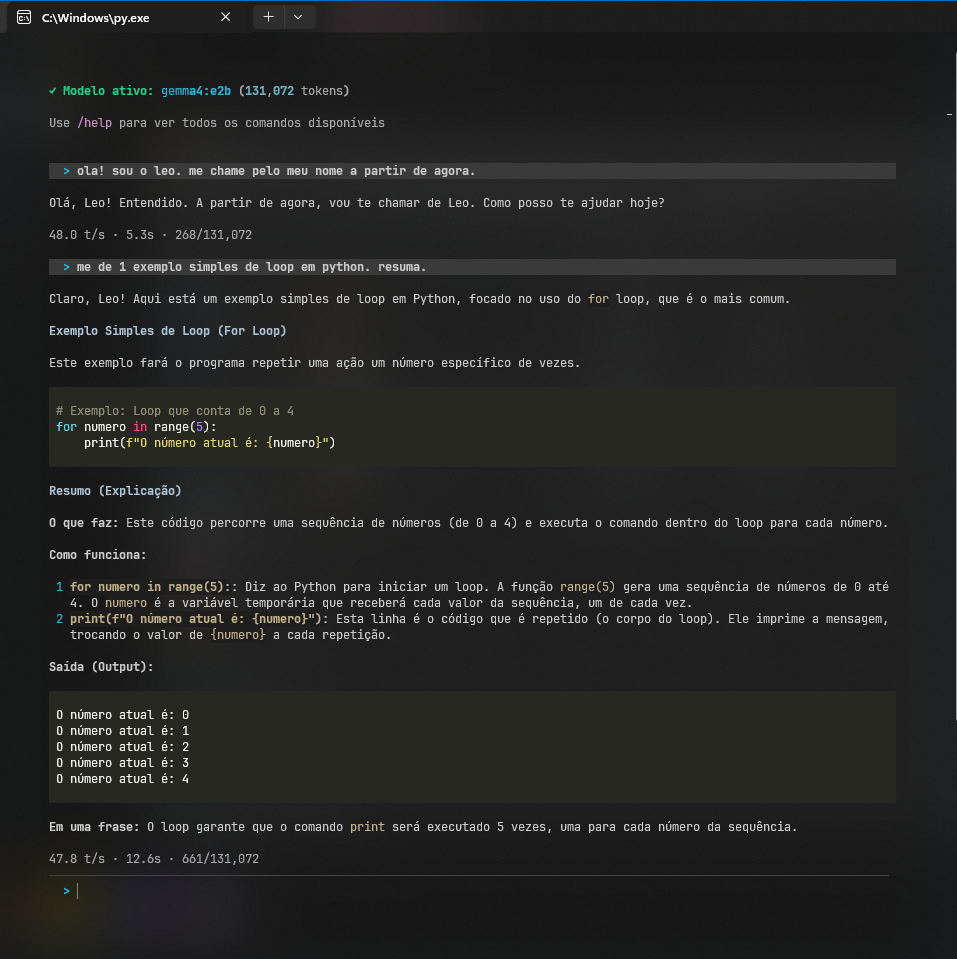
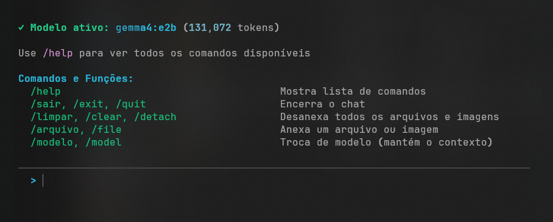
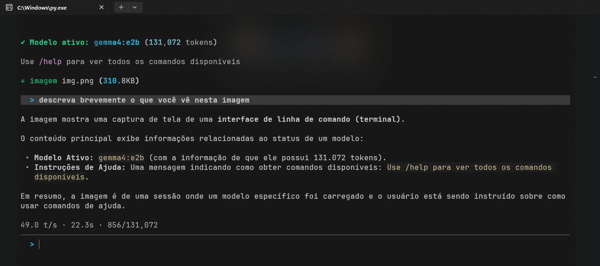

# Ollama Chat

Chat interativo no terminal para modelos locais via [Ollama](https://ollama.com). Interface rica com streaming em tempo real, anexo de arquivos/imagens e troca de modelo sem perder contexto.

<p align="center">
  <!-- Substitua pelo print da tela de seleção de modelo -->
  
</p>

---

## Funcionalidades

- Streaming token-a-token com indicador de progresso
- Seletor interativo de modelos (setas + Enter)
- Anexo de arquivos de texto e imagens (modelos com visão)
- Troca de modelo em tempo de execução mantendo o histórico
- Estatísticas por resposta (tokens/s, duração, uso de contexto)
- Interrupção de resposta com `ESC`
- Interface colorida com renderização de Markdown

<p align="center">
  <!-- Substitua pelo print de uma conversa completa -->
  
</p>

---

## Pré-requisitos

| Requisito | Versão mínima |
|-----------|---------------|
| [Python](https://python.org) | 3.10+ |
| [Ollama](https://ollama.com) | qualquer |

O Ollama precisa estar rodando localmente e ter pelo menos um modelo instalado:

```bash
ollama pull gemma4:e2b
```

---

## Instalação

```bash
# Clone o repositório
git clone https://github.com/leopansonato/ollama-chat.git
cd ollama-chat

# Instale as dependências
pip install -r requirements.txt
```

### Dependências

| Pacote | Uso |
|--------|-----|
| `ollama` | Comunicação com a API local do Ollama |
| `rich` | Interface rica no terminal (cores, markdown, spinners) |

---

## Como usar

```bash
python main.py
```

Ao iniciar, o seletor de modelos aparece automaticamente. Escolha com as setas e pressione Enter.

<p align="center">
  <!-- Substitua pelo print mostrando os comandos /help -->
  
</p>

### Comandos

| Comando | Aliases | Descrição |
|---------|---------|-----------|
| `/help` | | Mostra lista de comandos |
| `/sair` | `/exit`, `/quit` | Encerra o chat |
| `/arquivo <caminho>` | `/file` | Anexa um arquivo ou imagem |
| `/limpar` | `/clear`, `/detach` | Remove todos os anexos |
| `/modelo` | `/model` | Troca de modelo (mantém o contexto) |

### Exemplo de uso com arquivo

```
  > /arquivo relatorio.txt
  + arquivo relatorio.txt (12.4 KB)

  (1 anexo) > resuma o conteúdo deste arquivo
```

### Exemplo de uso com imagem

```
  > /file foto.png
  + imagem foto.png (340.2 KB)

  (1 anexo) > descreva o que você vê nesta imagem
```

> Imagens exigem um modelo com suporte a visão (ex: `llava`, `gemma3`).

<p align="center">
  <!-- Substitua pelo print mostrando anexo de arquivo ou imagem -->
  
</p>

---

## Estrutura do projeto

```
ollama-chat/
├── main.py               # Ponto de entrada
├── requirements.txt      # Dependências
└── chat/
    ├── __init__.py
    ├── session.py        # Gerenciamento da sessão de chat
    ├── ollama_client.py  # Comunicação com a API do Ollama
    ├── ui.py             # Interface do terminal (Rich)
    ├── commands.py       # Registro e handlers de comandos
    └── attachments.py    # Leitura de arquivos e imagens
```

---

## Atalhos

| Tecla | Ação |
|-------|------|
| `↑` `↓` | Navegar na seleção de modelo |
| `Enter` | Confirmar seleção |
| `ESC` | Interromper geração de resposta |
| `Ctrl+C` | Encerrar o programa |

---

## Licença

Este projeto é protegido por direitos autorais. Todos os direitos reservados. Consulte o arquivo [LICENSE](LICENSE) para mais detalhes.
